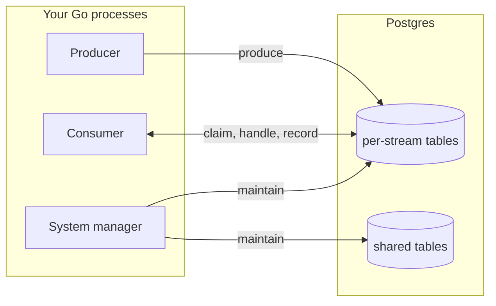

# Architecture

High level overview of how SQLStreams works.

## Overview

SQLStreams is a Go library that uses Postgres as the message broker. There
is no server. A process can be a producer, a consumer, a system manager
that runs the maintenance workers, or all three. Each stream owns its own
set of tables, named with the stream id (`message_log_1`). Shared tables
list the streams, groups, workers, and schedules.

> [!NOTE]
> By default, `Consume` runs the system manager alongside its session. A database lease lets one manager reconcile maintenance workers at a time.

## Where to start reading the code

- Client: [client/client.go](client/client.go).
- Producer: [pkg/producer/producer_instance.go](pkg/producer/producer_instance.go).
- Consumer: [pkg/consumer/consumer_instance.go](pkg/consumer/consumer_instance.go).
- System manager: [pkg/systemmanager/systemmanager.go](pkg/systemmanager/systemmanager.go).
- Tables: [pkg/stream/controller/datastore/tables.go](pkg/stream/controller/datastore/tables.go).

## Code map

The root module holds `client/` (package `sqlstreams`) and the implementation
under `pkg/`. The client shares the root module's dependencies and version.
Nested modules with their own `go.mod`:

| Module | Holds |
| --- | --- |
| `cmd/sqlstreams` | CLI |
| `otel` | metrics exporter |
| `.tests` | integration tests (`integration/`) and end-to-end tests with their support commands (`e2e/`) |
| `examples` | runnable user examples |
| `.bench` | benchmark scenarios and their runner |
| `.tools` | convention tests, compatibility checks, doc-site exports |

Library packages are one of three kinds. All except `client/` live under `pkg/`:

| Kind | Packages |
| --- | --- |
| shared by everything | `common` (Owner, StoredMessage, RetryPolicy, errors, logging), `datastore` (pool, transactions) |
| one per resource or activity | `stream`, `produce`, `consume`, `compaction`, `schedule`, `worker`, `metric`, `alert`, `system`, `migrate` |
| the three boxes on the left, no SQL of their own | `client/` (package `sqlstreams`), `producer`, `consumer`, `scheduler`, `systemmanager`, `admin` |

The workers the system manager runs are under the package whose tables
they maintain: `stream/janitor`, `consume/janitor`,
`consume/cursoradvancer`, `schedule/producer`, `metric/collector`, and
the checks under `alert`.

## Invariants

- No server or daemon. The library runs in your process.
- No dependency beyond the standard library, `pgx`, and `x/sync`.
- No LISTEN/NOTIFY. Everything polls.
- No `stream_id` column on a per-stream table. The table name says which
  stream.
- No transaction shared with the application except during produce.
- No payload or user document in a log line or error.

## Everywhere

- Named diagnostics for errors, events, metrics, and alerts have a `SQLnnnn` code
  in each package's `errors.go`, `events.go`, `metrics.go`, and
  `alerts.go`. `sqlstreams explain` reads them.
- `DatastoreRetry` retries supported internal database operations after
  transient errors. Caller-owned transactions are not retried, and operations
  without idempotency protection stop when the commit outcome is unknown.
- Configs hold optional fields only, filled by `WithDefaults()` then
  checked by `Validate()`.
- Per-stream tables are named only through the functions in `pkg/stream`.
